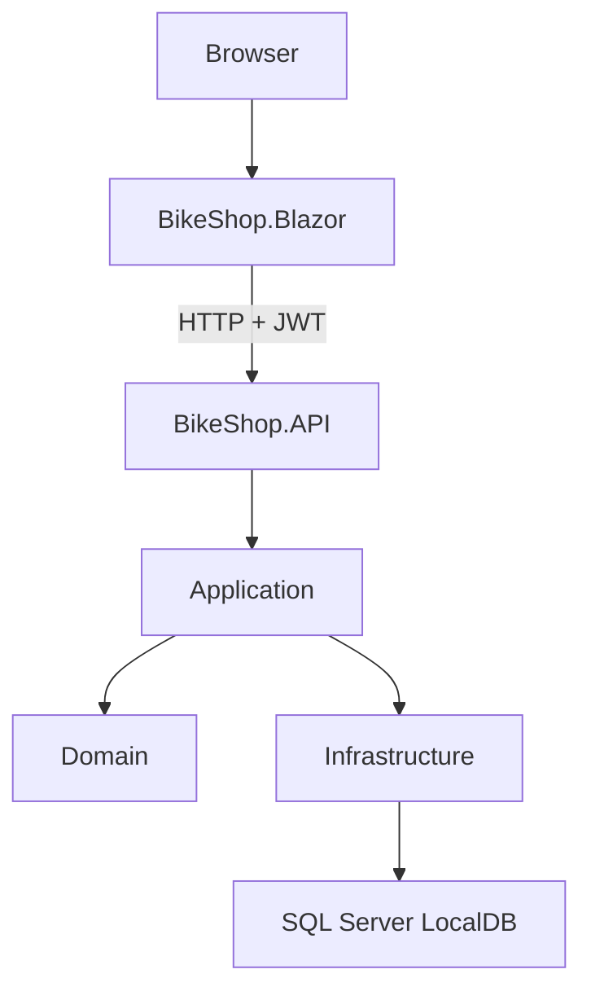
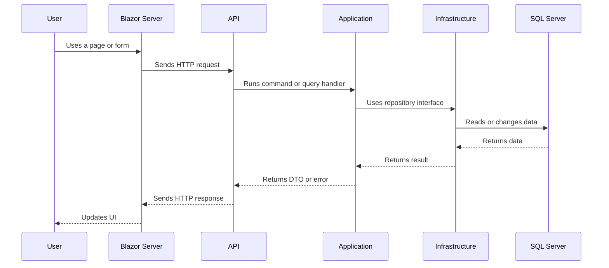

# Architecture

## Overview

BikeShop uses a layered architecture.

The application has two entry points:

- `BikeShop.Blazor` is the Blazor Server web application.
- `BikeShop.API` is the HTTP API.

Blazor Server is responsible for the user interface. It calls the API through HTTP. The API runs application use cases and works with the database through the Infrastructure layer.

## Projects and Responsibilities

| Project | Responsibility |
|---|---|
| `BikeShop.Domain` | Business entities, value types, domain rules, and domain exceptions. |
| `BikeShop.Application` | Commands, queries, handlers, DTOs, interfaces, and use cases. |
| `BikeShop.Infrastructure` | EF Core, `DbContext`, repositories, Identity storage, and database configuration. |
| `BikeShop.API` | Controllers, JWT authentication, authorization, dependency injection, and HTTP responses. |
| `BikeShop.Blazor` | Razor components, pages, UI state, API clients, local storage, and CSS. |

## Layer Rules

- The Domain layer does not depend on ASP.NET Core, EF Core, or Blazor.
- The Application layer contains use cases and depends on Domain concepts.
- Infrastructure implements database access and other technical details.
- API depends on Application and Infrastructure.
- Blazor does not access the database directly. It communicates with the API through HTTP.

## Main Request Flow

A typical request follows this path:

## Authentication and Authorization

ASP.NET Core Identity stores users and roles in the database.

After login, the API creates a JWT token. Blazor stores the token in browser local storage and sends it in the `Authorization` header when it calls protected API endpoints.

The application has two main roles:

- `Customer`
- `Admin`

Authorization is applied both in the API and in Blazor pages.

## Client State

BikeShop has two cart types:

- A Guest cart is stored in browser local storage.
- An authenticated Customer cart is stored in the database.

After login, Blazor sends the guest cart to the API and synchronizes it with the server cart.

Product images are stored in the Blazor project's `wwwroot` folder. The Blazor UI reads them through `ProductImageService`.

## Future Improvements

A larger Marketplace project may add:

- Search, filters, sorting, and pagination.
- A production image storage service.
- Payment and notification integrations.
- A separate Blazor WebAssembly client.