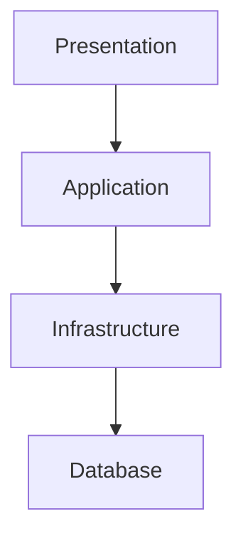
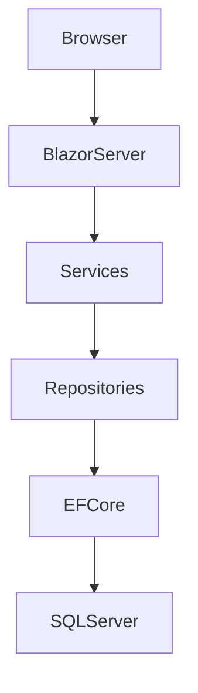

# 1. System Overview
We are building BikeShop, a web-based e-commerce application for selling bicycles and related products. 
The system allows customers to browse the product catalog, manage a shopping cart, and place orders through a secure and user-friendly interface. 
The application is designed as a portfolio-quality project demonstrating clean layered architecture, domain-driven design principles, and modern ASP.NET Core development practices.

# 3. System Components
<!-- - Web UI
- API Layer
- Application Layer
- Domain Layer
- Infrastructure Layer -->
- The system follows a layered architecture designed to separate concerns and improve maintainability.
- Web UI is responsible for user interaction and presentation.
- API Layer exposes application functionality to external clients.
- Application Layer contains use cases and coordinates business workflows such as Checkout and Order processing.
- Domain Layer contains core business logic and entities such as Product, Cart, and Order.
- Infrastructure Layer provides implementation details such as database access (EF Core), external services, and file storage.

# 4. Key Modules
<!-- - Catalog
- Product Discovery
- Cart
- Checkout
- Orders
- Account
- Admin -->
- The system is divided into functional modules representing core business capabilities.
- Catalog handles product listing and browsing.
- Product Discovery provides search, filtering, and sorting capabilities.
- Cart manages temporary product selection before purchase.
- Checkout handles order creation from cart and applies business rules.
- Orders manages order lifecycle and status tracking.
- Account handles authentication and user profile management.
- Admin provides administrative access to manage products, categories, orders, and customers.

# 5. Data Flow
The system follows a standard request lifecycle based on a layered architecture.

1. A user interacts with the Web UI (browser or client application).
2. The request is sent to the API Layer via HTTP.
3. The API Layer delegates the request to the Application Layer.
4. The Application Layer executes the corresponding use case (e.g., Checkout, Browse Products, Manage Cart).
5. The Application Layer interacts with the Domain Layer to apply business rules.
6. The Domain Layer performs business logic and returns results.
7. The Application Layer coordinates persistence operations via abstractions (repositories).
8. The Infrastructure Layer handles database access and external services (e.g., EF Core, email services).
9. The response is returned back through API Layer to the Web UI.

# 6. External Systems (future)
The system is designed to be extensible and may integrate with external systems in the future.

Planned integrations include:

- Payment providers (e.g., Stripe, PayPal)
- Email delivery services for notifications (order confirmation, password reset)
- Possibly third-party analytics or monitoring tools

# 7. Future Considerations

- Order may contain shipping information snapshot.
- Order should preserve customer and product information at the moment of purchase.