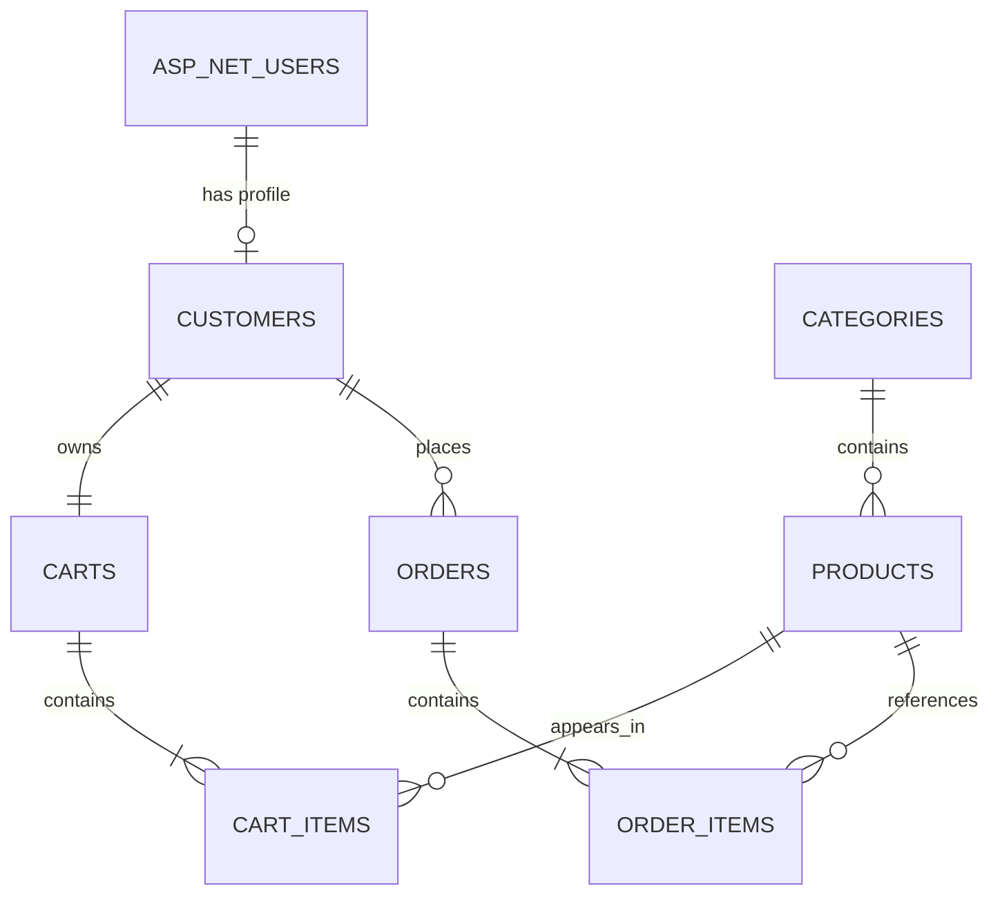

# Database Design

BikeShop uses SQL Server LocalDB and Entity Framework Core.

The main application data is stored in the BikeShop database. Authentication data is stored by ASP.NET Core Identity.

## Main Tables

### Categories

Stores product categories.

Main fields:

- Id
- Name

A category can contain many products.

### Products

Stores products available in the catalog.

Main fields:

- Id
- Name
- Description
- Price
- StockQuantity
- CategoryId

Price is stored as `decimal(18,2)`.

Each product belongs to one category.

### Customers

Stores the business customer profile.

Main fields:

- Id
- ApplicationUserId

`ApplicationUserId` links the customer to an ASP.NET Core Identity user and is unique.

Each customer has one server cart and can have many orders.

### Carts

Stores server-side carts for authenticated customers.

Main fields:

- Id
- CustomerId

A customer has one cart.

### CartItems

Stores products added to a server cart.

Main fields:

- Id
- CartId
- ProductId
- Quantity

The same product cannot appear twice in one cart. This is enforced by a unique index on `CartId` and `ProductId`.

Cart item price is taken from the current product price. It is not stored as a separate database field.

### Orders

Stores customer orders.

Main fields:

- Id
- CustomerId
- Status
- CreatedAt
- DeliveryAt
- DeliveryAddress
- CustomerPhone
- CourierPhone
- PaymentMethod

An order belongs to one customer and contains one or more order items.

### OrderItems

Stores products included in an order.

Main fields:

- Id
- OrderId
- ProductId
- Quantity
- UnitPrice

`UnitPrice` is a price snapshot. It keeps the product price at the moment when the order was created.

## Identity Tables

ASP.NET Core Identity creates its own tables.

The most important ones are:

- AspNetUsers
- AspNetRoles
- AspNetUserRoles
- AspNetUserClaims
- AspNetUserLogins
- AspNetUserTokens

BikeShop uses the Customer and Admin roles.

## Relationships

## Important Rules

- A product belongs to exactly one category.
- A customer has exactly one server cart.
- A cart item references one product and one cart.
- A cart cannot contain duplicate items for the same product.
- An order contains one or more order items.
- An order item stores the product price at the time of purchase.
- Deleting an order also deletes its order items.
- Deleting a product referenced by an order item is restricted.

## Notes

- Product images are not stored in the database.
- Images are stored as WebP files in `BikeShop.Blazor/wwwroot/images/products/{productId}`.
- The current image storage approach is suitable for the local MVP. A production application would use separate durable file storage.