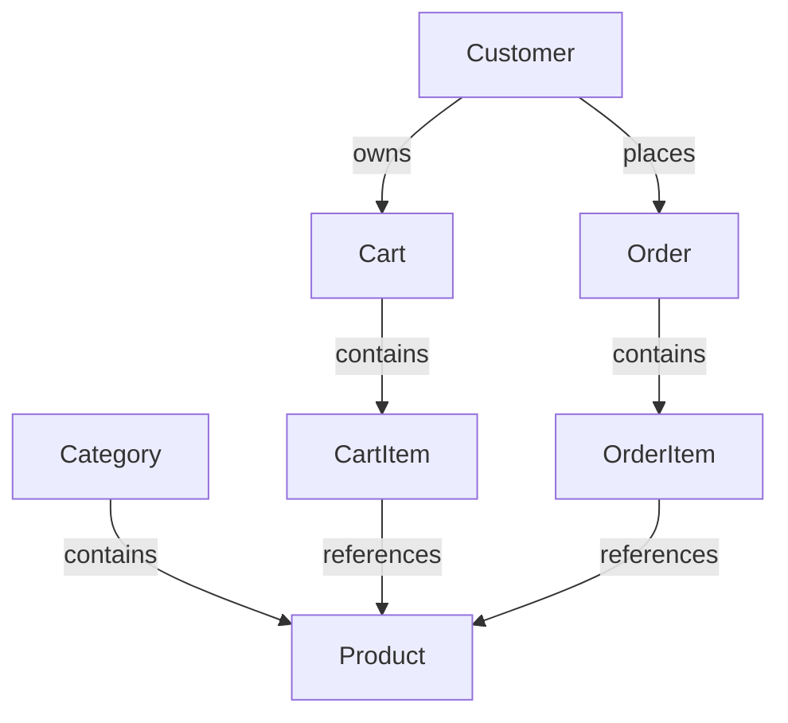

# Domain Model

This document describes the main business objects in BikeShop. Database mapping and EF Core configuration are described in `Database.md`.

## Category

A Category groups products in the catalog.

A category has a name and contains many products.

## Product

A Product is an item that customers can buy.

Main data:

- Name
- Description
- Price
- Stock quantity
- Category

A product belongs to one category. It can appear in cart items and order items.

## Customer

A Customer represents a registered store user in the business model.

A customer is linked to an ASP.NET Core Identity account through `ApplicationUserId`. Each customer has one server cart and can create many orders.

## Cart

A Cart represents the current server-side cart of one customer.

A cart can:

- Add products.
- Change product quantities.
- Remove products.
- Clear all items.
- Calculate the total price.

A guest cart is stored separately in browser local storage. After login, it can be synchronized with the customer's server cart.

## CartItem

A CartItem represents one product in a cart.

It stores:

- Product
- Quantity
- Current product price

A cart item belongs to one cart and references one product.

## Order

An Order represents a purchase created from a customer's cart.

It stores:

- Customer
- Order items
- Status
- Creation date
- Delivery date
- Delivery address
- Customer phone number
- Payment method
- Optional courier phone number

An order can change its delivery information only when its current status allows editing.

Order statuses:

- Pending
- Paid
- Shipped
- Completed
- Cancelled

The Order entity controls allowed status changes. Completed and cancelled orders cannot be edited or cancelled.

## OrderItem

An OrderItem represents one product in an order.

It stores:

- Product reference
- Quantity
- Unit price at the time of order creation

The unit price is stored as a snapshot. Later product price changes do not change existing orders.

## Relationships

## Notes

- Authentication and roles are handled by ASP.NET Core Identity.
- The Customer entity is a business concept. It is not the same as an Identity user.
- Product images are not domain entities in BikeShop. They are stored as WebP files in the Blazor application's `wwwroot` folder.